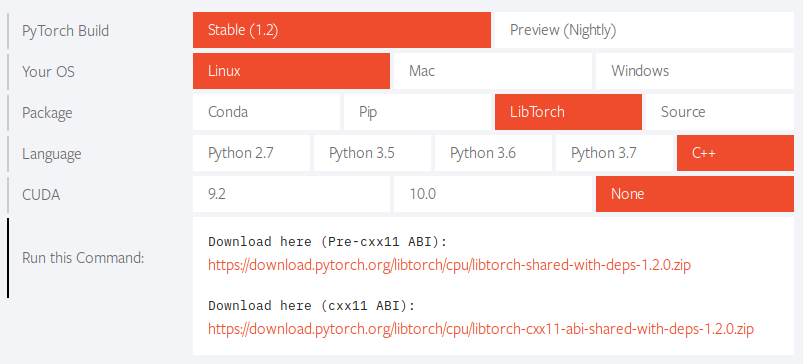

# PyTorch-Python-Cpp
Experimental repository compiling comparison implementation of code written in Python and C++.
While the Python implementations should run on any OS, the C++ implementations were only tested on Linux. 

## Get PyTorch/libtorch
Go to [PyTorch](https://pytorch.org/) and download the corresponding package. 



Then simply extract the zip file where you want to install the library or follow the instruction depending on the language selected. 

## ./example-app
This folder contains the implemented *minimal example* provided by PyTorch. It can be found [here](https://pytorch.org/cppdocs/installing.html). 

The project can be compiled and run like so: 
```
mkdir build
cd build
cmake -DCMAKE_PREFIX_PATH=/absolute/path/to/libtorch ..
make
```

## ./pycpp

This folder aims at implementing the same program both in **C++** and **Python** to illustrate the similarities of the **PyTorch** API between both languages. 

A simple neural net is created and trained on a dummy dataset. It consists of points inside a circle of a given radius and points outside of it. The network learns to differentiate the two classes. 

### Python 

To run the python script: 

```bash
python3 -m demo
```

### C++ 

To build the C++ code: 

```bash
./build.sh
```

> :warning: you need to adapt the **libtorch** installation path in the `build.sh` script. 

To run the C++ code: 

```bash
./run.sh
```

#### Saving models in C++

A model can be simply created and used like the following: 

```cpp
struct Net: torch::nn::Module{

    Net(){
      // Constructor - build the network's layers
      _in = register_module("in",torch::nn::Linear(2,10));
      _h = register_module("h",torch::nn::Linear(10,5));
      _out = register_module("out",torch::nn::Linear(5,1));
    }
    
    torch::Tensor forward(torch::Tensor x){
      // apply ReLU activations and sigmoid for the output
      x = torch::relu(_in->forward(x));
      x = torch::relu(_h->forward(x));
      x = torch::sigmoid(_out->forward(x));
        
      // return the output
      return x;
    }

    torch::nn::Linear _in{nullptr},_h{nullptr},_out{nullptr};
};

void main(){
    // Usage: 
    Net model = Net();
    model.train();
    model.forward();
    // ...
}
```

But this will not allow to save the network to the disk. To do so, the implementation should be as follows: 

```cpp
struct NetImpl: torch::nn::Module{

    NetImpl(){
      // Constructor - build the network's layers
      _in = register_module("in",torch::nn::Linear(2,10));
      _h = register_module("h",torch::nn::Linear(10,5));
      _out = register_module("out",torch::nn::Linear(5,1));
    }
    
    torch::Tensor forward(torch::Tensor x){
      // apply ReLU activations and sigmoid for the output
      x = torch::relu(_in->forward(x));
      x = torch::relu(_h->forward(x));
      x = torch::sigmoid(_out->forward(x));
        
      // return the output
      return x;
    }

    torch::nn::Linear _in{nullptr},_h{nullptr},_out{nullptr};
};
TORCH_MODULE(Net);

void main(){
    // Usage: 
    Net model = Net();
    model->train();
    model->forward();
    // ...
}
```

Here, `TORCH_MODULE` creates a module holder, which is a `std::shared_ptr<NetImpl>`. This enables the user to then call `torch::save(model,"path");` and `torch::load(model,"path");`. 

## ./webots

This folder demonstrates how to link a **shared object** implementing the deep learning functionalities of the project to a Webots controller. 

The [minimal `CMakeLists.txt` example](https://pytorch.org/cppdocs/installing.html) can be directly used by replacing `add_executable(example-app example-app.cpp)` by `add_library(example-app SHARED example-app.cpp)`. This will create the `libexample-app.so` whose functions can be called by a Webots controller when placed in the `library` folder of the Webots project.  

The Webots `makefile` must be modified by adding the following lines to find the shared object:

```makefile
INCLUDE = -I"/path/the/shared/object's/header" 
LIBRARIES = -L"/path/the/shared/object" -lexample-app
```


